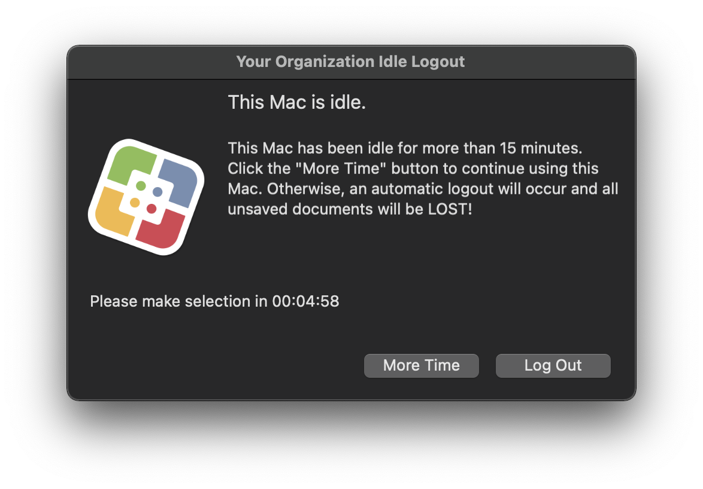

# Auto Logout

To deploy this script, you will need to create a package. You will need to place the files at the following locations:

| File | Path | Permissions |
| ------------- | ------------- | ------------- |
| autoLogout.zsh | /Library/Scripts/autoLogout/ | rwxr--r-- |
| com.yourorganization.autoLogout.plist | /Library/LaunchDaemons/ | rw-r--r-- |

The launch daemon will load after the next restart. However, if you want it to load immediately, you can add the post-install script to your package.

## [autoLogout.zsh](./autoLogout.zsh)

This script will display the following popup to the logged-in user if the Mac passes a specified idle time:

(The maximum idle time is 16 minutes and 10 seconds in the script.) If the user clicks "Log out" or the popup times out, the script will quit all applications and log out the user. 

## [autoLogoutNoPopup.zsh](./autoLogoutNoPopup.zsh)

This script will automatically quit all open applications and log out the logged-in user if the Mac passes a specified idle time. (The maximum idle time is 16 minutes and 10 seconds in the script.

## [autoLogoutPostinstall.sh](./autoLogoutPostinstall.sh)

This script will force load the launch daemon. 

## [com.yourorganization.autoLogout.plist](./com.yourorganization.autoLogout.plist)

This launch daemon runs the autoLogout.zsh script every five minutes. 
